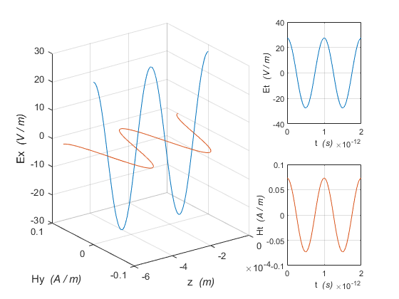
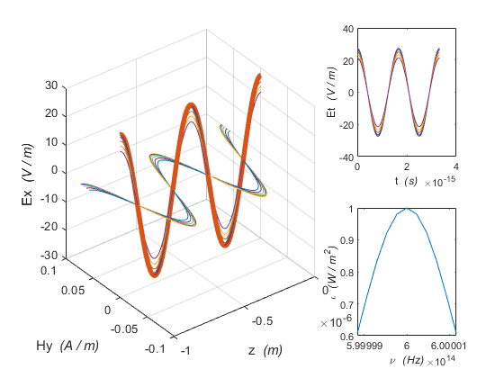

# Simulation Using Matlab

---

*&emsp;A simulation of resonator optical gyroscope detection system.*

*note: 1. The prefix 'x' express a custom class
&emsp;&ensp;&emsp;2. The code style using K&R  
&emsp;&ensp;&emsp;3. The math symbol using LaTex*  
>Reference:
>&emsp;Ajoy Ghatak.'Optics (6th)'. McGraw-Hill Education and Tsinghua University Press  
>&emsp;Marlan O.Scully, M.Suhail Zubairy. 'Quantum Optics'. Cambridge University Press  
>&emsp;[Website: wikipedia/Gaussian_beam](http://en.wikipedia.org/wiki/Gaussian_beam)  
>&emsp;Ting-Chung Poon, Taegeun Kim. 'Engineering Optics With Matlab'. World Scientific Publishing Co. Pte. Ltd  
>&emsp;欧攀. '高等光学仿真(MATLAB版)'. 北京航空航天大学出版社  

## xLight

---

&emsp;As we know, light is a kind of electromagnetic wave. So, in this term, the light is constructed by a single pattern electromagnetic wave. Both symbolic expression and numeric expression are supported in this class.

+ ### xLight Function Using Detail

+ 1. ***construct function***  
*obj = xLight($\Iota$, $\nu$) $\longrightarrow$ $\Iota$ is a specify light intensity ($W /m^2$), $\nu$ is a specify frequency($Hz$).
obj = xLight($\Iota$, $\nu$, $pos$) $\longrightarrow$ this can specify the light position
obj = xLight($\Iota$, $\nu$, $pos$, $X$, $Y$) this can specify the light position and polarization
obj = xLight($E$, $H$, $k$, $\omega$) $\longrightarrow$ using Maxwell equations parameters to construct object.*

*Eg.*

    >> tmp = xLight(1,1e12)
    tmp = 
    xLight - attribute:
         e0: 27.4492
         h0: 0.0729
      omega: 6.2832e+12
          k: 2.0958e+04
    epsilon: 8.8542e-12
         mu: 1.2566e-06
          X: [0 0 1]
          Y: [0 1 0]
      symEx: [1×3 sym]
      symHy: [1×3 sym]

+ 2. ***fundamental function***
  *outVel = getVelocity()
  outIota = getIntensity()
  outEta = getImpedance()
  outLambda = getWaveLength()
  outNu = getWaveFreq()
  obj = setPattern(inK)
  obj = setPolarization(Ex, Hy)
  [outEx, outHy] = lighting(inZ, inT) $\longrightarrow$ emit a light*

*Eg.*

    >> tmp.getImpedance()
    ans =
      376.7301

    >> tmp.getIntensity()
    ans =
         1

    >> tmp.getVelocity()
    ans =
       2.9979e+08

    >> tmp.getWaveFreq()
    ans =
       1.0000e+12

    >> tmp.getWaveLength()
    ans =
       2.9979e-04

    >> tmp.setPolarization([sqrt(2)/2, sqrt(2)/2, 0], [-sqrt(2)/2, sqrt(2)/2, 0])
    ans = 
      xLight - attribute:
         e0: 27.4492
         h0: 0.0729
      omega: 6.2832e+12
          k: 2.0958e+04
    epsilon: 8.8542e-12
         mu: 1.2566e-06
          X: [0.7071 0.7071 0]
          Y: [-0.7071 0.7071 0]
      symEx: [1×3 sym]
      symHy: [1×3 sym]

    >> tmp.setPattern(2.5e10)
    ans = 
      xLight - attribute:
         e0: 27.4492
         h0: 0.0729
      omega: 6.2832e+12
          k: 2.5000e+10
    epsilon: 8.8542e-12
         mu: 1.2566e-06
          X: [0 0 1]
          Y: [0 1 0]
      symEx: [1×3 sym]
      symHy: [1×3 sym]

    >> tmp.getWaveLength
    ans =
       2.9979e-04

    >> z = 0: ans / 1000 : ans;
    >> [Ex, Hy] = tmp.lighting(z', zeros(size(z))');

+ 3. ***display function***
   *outFig = dispMine(obj)*

*Eg.*

    >> tmp.dispMine()
    ans = 
      Figure (1: Light Property) - attribute:
          Number: 1
            Name: 'Light Property'
           Color: [0.9400 0.9400 0.9400]
        Position: [680 558 560 420]
           Units: 'pixels'

+ ### xLight Simulation Result & Nomenclature
  
&emsp;The xLight simulation as following:

&emsp;The nomenclature as following:
Abbreviation|Name
--          |--
$\omega$    |Angular frequency in plane electromagnetic waves.($rad / s$)
$\eta$      |Medium intrinsic impedance. ($Ohm$)
$k$         |Pattern. ($m$)
$v$         |The speed of electromagnetic ($m / s$)
$\lambda$   |Light wave length. ($m$)
$\nu$       |Light wave frequency. ($Hz$)
$\Iota$     |Light intensity. ($W / m^2$)
$\epsilon$  |Permittivity ($C^2 / (N * m^2)$)
$\mu$       |permeability ($N * s^2 / C^2$)
$e0$        |Electric field intensity. ($V / m$)
$h0$        |Magnetic field intensity. ($A / m$)
$\bold X$   |The unit vector of electric field polarization
$\bold Y$   |The unit vector of magnetic field polarization
$symEx$     |The symbol expression of electric field
$symHy$     |The symbol expression of magnetic field
$pos$       |The light position

## xBeam

---

&emsp;A light beam is consist of various property lights. Both symbolic expression and numeric expression are supported in this class.

+ ### xBeam Function Using Detail

+ 1. ***construct function***
  *obj = xBeam(lights) $\longrightarrow$ lights is an array of xLight objects.
  obj = xBeam($numOfR$, $numOf\theta$, $\omega_0$, $\lambda$, $\Iota_0$)$\longrightarrow$ an immature method, use the method to construct a gaussian beam.$numOfR$ indicate the number of $R$ that range from : 0 ~ 3$\omega_0$. $\omega_0$ is the waist size. And the $numOf\theta$ slice the 2$\pi$ to $numOf\theta$ interval. Finally, the $\lambda$ and the $\Iota_0$ indicate the wave length and intensity of the Gaussian beam, respectively. note: this function using parallel compute to speed up computation*

*Eg.*

    >> tmp = xBeam(0, 1, 6e14, 7000e6)
    tmp = 
      xBeam - attribute:    
        grpLight: [1×11 xLight]
            iota: 9.1425
           symEx: [1×3 sym]
           symHy: [1×3 sym]

    >> tmp = xBeam(0, 0, 1.58e-6, 1.55e-6, 10e-3)
    tmp = 
      xBeam - attribute:
    grpLight: [1×100 xLight]
     epsilon: 8.8542e-12
          mu: 1.2566e-06
        iota: [1×1 sym]
       symEx: [1×3 sym]
       symHy: [1×3 sym]

+ 2. ***fundamental function***
  *obj = pushLight(lights)
  obj = deleteLight(indexArr)
  [outEx, outHy] = beaming(inZ, inT) $\longrightarrow$ emit a beam, note: becareful, this function will take huge computation time*

*Eg.*

    >> tmp.pushLight(xLight(1, 1e14))
    ans = 
      xBeam - attribute:
        grpLight: [1×12 xLight]
            iota: 10.1425
           symEx: [1×3 sym]
           symHy: [1×3 sym]

    >> disp(tmp)
      xBeam - attribute:
        grpLight: [1×94 xLight]
            iota: 84.1422
           symEx: [1×3 sym]
           symHy: [1×3 sym]
    >> deleteArr = [1,3,4]
    deleteArr =
         1     3     4
    >> tmp = tmp.deleteLight(deleteArr)
    tmp = 
      xBeam - attribute:
        grpLight: [1×91 xLight]
            iota: 82.0346
           symEx: [1×3 sym]
           symHy: [1×3 sym]

    >> z = 0: ans / 1000 : ans;
    >> [Ex, Hy] = tmp.beaming(z', zeros(size(z))');

+ 3. ***display function***
  *outFig = dispMine()
  outFig = dispMineGausBeam()*

*Eg.*

    >> tmp.dispMine
    ans = 
      Figure (1: Beam Property) - attribute:
          Number: 1
            Name: 'Beam Property'
           Color: [0.9400 0.9400 0.9400]
        Position: [680 558 560 420]
           Units: 'pixels'

    >> tmp.dispMineGausBeam
    ans = 
      Figure (2: Gaussian Beam Property) - attribute:
          Number: 2
            Name: 'Gaussian Beam Property'
           Color: [0.9400 0.9400 0.9400]
        Position: [680 558 560 420]
           Units: 'pixels'

+ ### xBeam Simulation Result & Nomenclature

&emsp;The xBeam simulation as following:
$\star$ Normal beam display result

$\star$ Gaussian beam display result

&emsp;The nomenclature as following:
Abbreviation|Name
--            |--
$grpLight$    |The lights contained within the beam ($xLight$)
$\Iota$       |Beam intensity. ($W / m^2$)
$symEx$       |The symbol expression of electric field
$symHy$       |The symbol expression of magnetic field
$numOfR$      |The interval numbers of radius
$numOf\theta$ |The interval numbers of 2$\pi$
$\omega_0$    |The waist size of Gaussian beam
$\lambda$     |The wave length of Gaussian beam
$\Iota_0$     |The intensity of Gaussian beam

## xLaser

---

+ ### xLaser Function Using Detail

+ 1. ***construct function***
  *obj = xBeam(nums, $\Iota_{f_0}$, $f_0$, $\Delta\nu$) $\longrightarrow$ an immature method, use the method to construct a gaussian beam. The nums specify the number of light that contained in this beam. The $\Iota_{f_0}$ is the light intensity of $f_0$. And the $f_0$ is a centre frquency of beam. The $\Delta\nu$ is the range of spectral linewidth.*
+ 2. ***fundamental function***

+ ### xLaser Simulation Result & Nomenclature

&emsp;The xLaser simulation as following:
$\star$ Gaussian beam display result

&emsp;The nomenclature as following:
Abbreviation|Name
--            |--
$f_0$         |The centre frquency of Gaussian beam ($Hz$)
$\Delta\nu$   |The range of spectral linewidth of Gaussian beam ($Hz$)

## xFiber

---

&emsp;The optical fiber is a single mode polarization-maintaining fiber.

+ ### xFiber Function Using Detail

+ 1. ***construct function***
  
+ 2. ***fundamental function***

+ ### xFiber Simulation Result & Nomenclature

&emsp;The xFiber simulation as following:

## xFlange

---

+ ### xFlange Function Using Detail

+ 1. ***construct function***
  
+ 2. ***fundamental function***

+ ### xFlange Simulation Result & Nomenclature

&emsp;The xFlange simulation as following:

## xResonatorCavity

---
&emsp;In terms of the components, a resonator cavity is combination by polarization-maintaining fiber and coupler.

+ ### xResonatorCavity Function Using Detail

+ 1. ***construct function***
  
+ 2. ***fundamental function***

+ ### xResonatorCavity Simulation Result & Nomenclature

&emsp;The xResonatorCavity simulation as following:

---
Copyright(c) 2021, by Yulu Zhong. All rights reserved. Key Laboratory of Micro-Inertial Instrument and Advanced Navigation Technology of Ministry of Education, Southeast University, NanJing, P.R.China 07/31/2021
